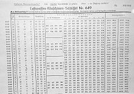
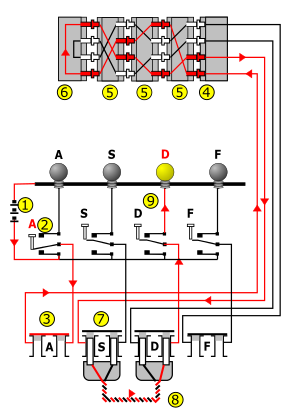
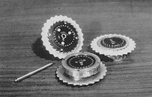
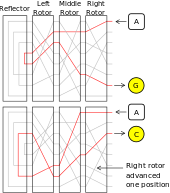

# Enigma Machine


 \
The Enigma machine is a cipher device developed and used in the early-to
mid-20th century to protect commercial, diplomatic, and military communication.
It was employed extensively by Nazi Germany during World War II, in all
branches of the German military. The Enigma machine was considered so secure
that it was used to encipher the most top-secret messages.

<!--  -->
<!--  -->
<!--  \ -->
The Enigma has an electromechanical rotor mechanism that scrambles the 26 letters
of the alphabet. In typical use, one person enters text on the Enigma's keyboard
and another person writes down which of the 26 lights above the keyboard
illuminated at each key press. If plain text is entered, the illuminated
letters are the ciphertext. Entering ciphertext transforms it back into
readable plaintext. The rotor mechanism changes the electrical connections
between the keys and the lights with each keypress.

The security of the system depends on machine settings that were generally
changed daily, based on secret key lists distributed in advance, and on other
settings that were changed for each message. The receiving station would have
to know and use the exact settings employed by the transmitting station to
successfully decrypt a message.

While Nazi Germany introduced a series of improvements to the Enigma over the
years, and these hampered decryption efforts, they did not prevent Poland from
cracking the machine as early as December 1932 and reading messages prior to
and into the war. Poland's sharing of her achievements enabled the western
Allies to exploit Enigma-enciphered messages as a major source of intelligence.
Many commentators say the flow of Ultra communications intelligence from the
decrypting of Enigma, Lorenz, and other ciphers shortened the war substantially
and may even have altered its outcome.


# operation
Basic operation
Enciphering and deciphering using an Enigma machine

 \

A German Enigma operator would be given a plaintext message to encrypt. After
setting up his machine, he would type the message on the Enigma keyboard.
For each letter pressed, one lamp lit indicating a different letter according
to a pseudo-random substitution determined by the electrical pathways inside
the machine. The letter indicated by the lamp would be recorded, typically by
a second operator, as the cyphertext letter. The action of pressing a key also
moved one or more rotors so that the next key press used a different electrical
pathway, and thus a different substitution would occur even if the same
plaintext letter were entered again. For each key press there was rotation
of at least the right hand rotor and less often the other two, resulting in
a different substitution alphabet being used for every letter in the message.
This process continued until the message was completed. The cyphertext recorded
by the second operator would then be transmitted, usually by radio in Morse code,
to an operator of another Enigma machine. This operator would type in the
cyphertext and — as long as all the settings of the deciphering machine were
identical to those of the enciphering machine — for every key press the reverse
substitution would occur and the plaintext message would emerge.

# Details

German Kenngruppenheft (a U-boat codebook with grouped key codes).

Monthly key list number 649 for the German Air Force Enigma, including settings for the reconfigurable reflector (which only change once every eight days).
In use, the Enigma required a list of daily key settings and auxiliary documents. In German military practice, communications were divided into separate networks, each using different settings. These communication nets were termed keys at Bletchley Park, and were assigned code names, such as Red, Chaffinch, and Shark. Each unit operating in a network was given the same settings list for its Enigma, valid for a period of time. The procedures for German Naval Enigma were more elaborate and more secure than those in other services and employed auxiliary codebooks. Navy codebooks were printed in red, water-soluble ink on pink paper so that they could easily be destroyed if they were endangered or if the vessel was sunk.

An Enigma machine's setting (its cryptographic key in modern terms; Schlüssel in German) specified each operator-adjustable aspect of the machine:

Wheel order (Walzenlage) – the choice of rotors and the order in which they are fitted.
Ring settings (Ringstellung) – the position of each alphabet ring relative to its rotor wiring.
Plug connections (Steckerverbindungen) – the pairs of letters in the plugboard that are connected together.
In very late versions, the wiring of the reconfigurable reflector.
Starting position of the rotors (Grundstellung) – chosen by the operator, should be different for each message.
For a message to be correctly encrypted and decrypted, both sender and receiver had to configure their Enigma in the same way; rotor selection and order, ring positions, plugboard connections and starting rotor positions must be identical. Except for the starting positions, these settings were established beforehand, distributed in key lists and changed daily. For example, the settings for the 18th day of the month in the German Luftwaffe Enigma key list number 649 (see image) were as follows:

Wheel order: IV, II, V
Ring settings: 15, 23, 26
Plugboard connections: EJ OY IV AQ KW FX MT PS LU BD
Reconfigurable reflector wiring: IU AS DV GL FT OX EZ CH MR KN BQ PW
Indicator groups: lsa zbw vcj rxn
Enigma was designed to be secure even if the rotor wiring was known to an opponent, although in practice considerable effort protected the wiring configuration. If the wiring is secret, the total number of possible configurations has been calculated to be around 3×10114 (approximately 380 bits); with known wiring and other operational constraints, this is reduced to around 1023 (76 bits).[24] Because of the large number of possibilities, users of Enigma were confident of its security; it was not then feasible for an adversary to even begin to try a brute-force attack.

# insatlling & useing

## by makefile

create virtual enviroment and install dependencies
```
make build
```

create rotors
```
make rotor
```

run app
```
make run
```

# TODO

- [ ] can run script with args (--code or --decode, --plain-txt-path, --output-path)
- [ ] tests
- [ ] publish package on pypi
- [ ] github actions for chick tests, and auto deploy on pypi
- [ ] readme
- [ ] ask for review


<!--  -->
